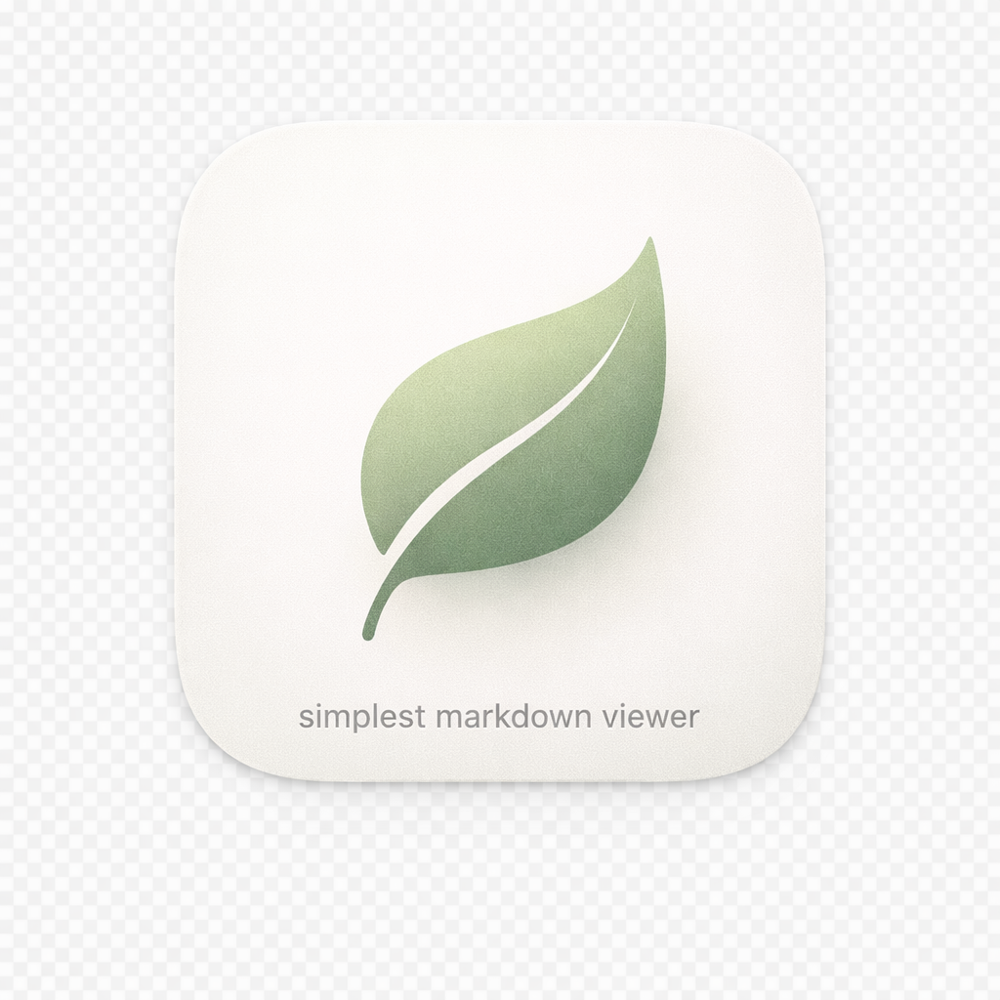

# Leaf Render Smoke Test

This file exercises the **core Markdown elements** we support. It includes _emphasis_, **strong**, ~~strikethrough~~, `inline code`, and a link to [Apple](https://apple.com).

---

## Typography + Layout

A calm paragraph with mixed styles: **bold**, _italic_, ~~strike~~, `code`, and a link to [OpenAI](https://openai.com).

### Blockquote

> This is a blockquote with **emphasis**, `inline code`, and a link to [example.com](https://example.com).
>
> Another line in the same quote to test spacing.

---

## Lists

Unordered list:
- First item with **bold** text
- Second item with `inline code`
- Third item with a link to [GitHub](https://github.com)

Ordered list:
1. Step one with _italic_ text
2. Step two with ~~strikethrough~~
3. Step three with `inline code`

---

## Table

| Feature | Example | Link | Notes |
| --- | --- | --- | --- |
| Bold | **Bold text** | [Apple](https://apple.com) | Simple emphasis |
| Code | `let value = 42` | [Swift](https://swift.org) | Inline code |
| Link | Link only | [OpenAI](https://openai.com) | Open in browser |

---

## Code Blocks (Syntax Highlighting)

```swift
import SwiftUI

struct GreetingView: View {
    let name: String

    var body: some View {
        Text("Hello, \(name)!")
            .font(.title)
    }
}
```

```javascript
function greet(name) {
  const message = `Hello, ${name}!`;
  console.log(message);
}
```

```python
def greet(name):
    message = f"Hello, {name}!"
    print(message)
```

```json
{
  "name": "Leaf",
  "version": 1,
  "enabled": true
}
```

```bash
#!/usr/bin/env bash
set -euo pipefail

echo "Leaf render test"
```

---

## Images (Local/Relative)



---

## Edge Case Notes

- Inline links should show a pointer cursor on hover and open in the default browser.
- Horizontal rules above should render as thin lines, not literal `---`.
- Large documents should remain smooth to scroll.

